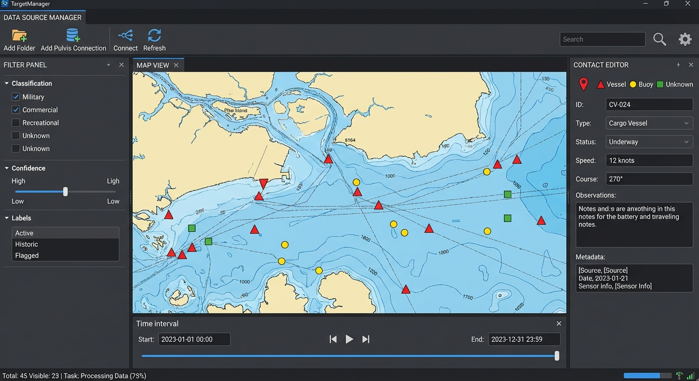
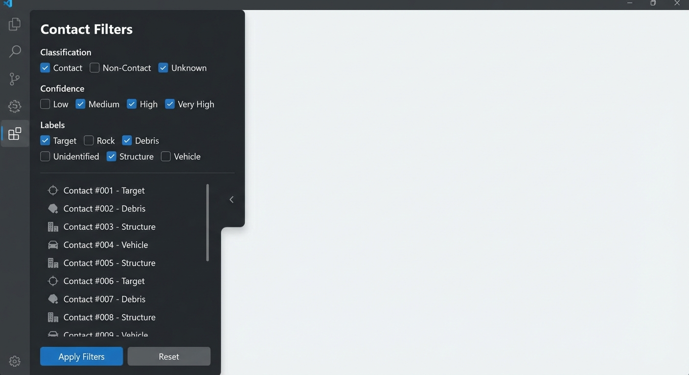
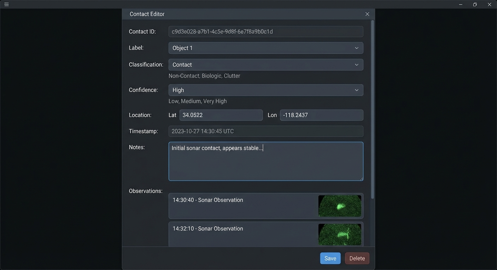
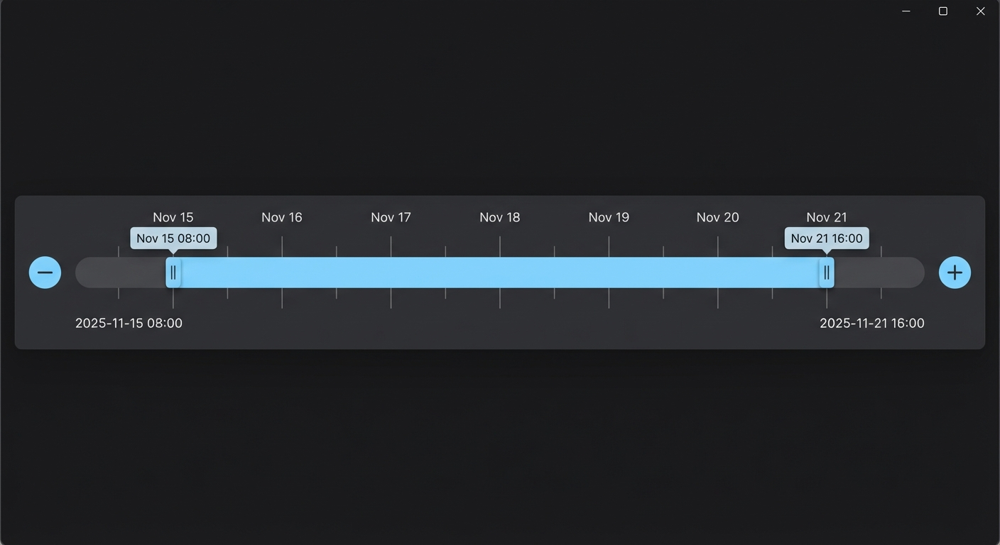
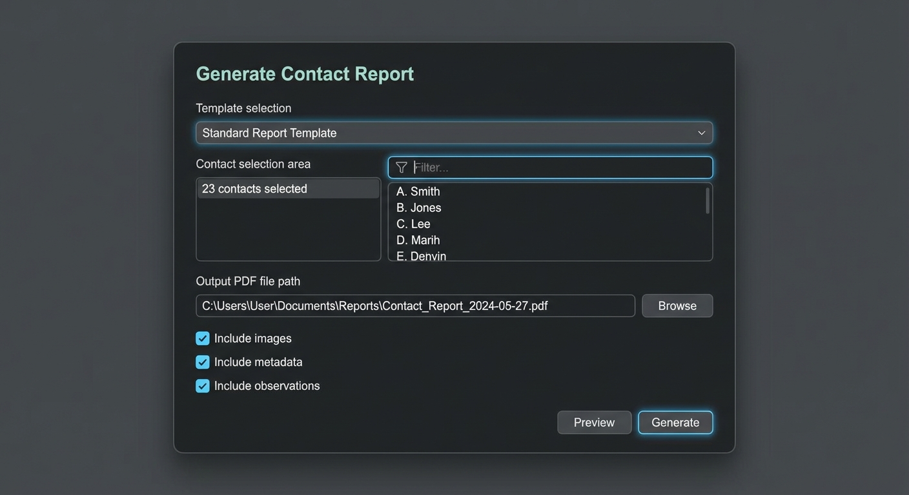

# TargetManager User Manual

**Version 2025.11.00 (Beta)**  
OceanScan Marine Systems & Technology

---

## Table of Contents

1. [Introduction](#introduction)
2. [Getting Started](#getting-started)
3. [User Interface Overview](#user-interface-overview)
4. [Working with Data Sources](#working-with-data-sources)
5. [Managing Contacts](#managing-contacts)
6. [Filtering and Searching](#filtering-and-searching)
7. [Time Selection](#time-selection)
8. [Contact Grouping](#contact-grouping)
9. [Generating Reports](#generating-reports)
10. [Preferences and Settings](#preferences-and-settings)
11. [Keyboard Shortcuts](#keyboard-shortcuts)
12. [Troubleshooting](#troubleshooting)

---

## Introduction

**TargetManager** is a professional desktop application for managing and visualizing marine contact data from sidescan sonar surveys. It provides powerful tools for organizing, filtering, and analyzing contacts discovered during underwater surveys.

### Key Features

- **Interactive Map Visualization**: View contacts on an interactive map with multiple base layer options
- **Data Source Management**: Load contacts from local folders or synchronize with Pulvis servers
- **Advanced Filtering**: Filter contacts by classification, confidence, labels, time, and location
- **Contact Grouping**: Group related contacts for better organization
- **PDF Report Generation**: Create professional reports with customizable templates
- **Real-time Synchronization**: Automatic updates when contact files change

### System Requirements

- **Operating System**: Windows 10/11, macOS 10.15+, or Linux (Ubuntu 20.04+, Fedora 35+)
- **Java**: JDK 21 or higher (bundled with installer versions)
- **Memory**: 4 GB RAM minimum, 8 GB recommended
- **Display**: 1280x720 minimum resolution, 1920x1080 recommended

---

## Getting Started

### Installation

#### Using the Installer (Recommended)

1. Download the appropriate installer for your platform:
   - Windows: `target-manager-2025.11.00.msi`
   - Linux: `target-manager_2025.11.00_amd64.deb` or `.rpm`
   - macOS: `target-manager-2025.11.00.dmg`

2. Run the installer and follow the on-screen instructions

3. Launch TargetManager from:
   - Windows: Start Menu → TargetManager
   - Linux: Applications → TargetManager
   - macOS: Applications folder → TargetManager

#### Using the Portable Edition

1. Extract the portable archive to your desired location
2. Run the launch script:
   - Windows: `target-manager.bat`
   - Linux/macOS: `./target-manager.sh`

**Note**: Portable edition requires Java 21 to be installed on your system

### First Launch

On first launch, TargetManager will:

1. Create a configuration directory in your home folder (`.targetmanager`)
2. Display the main interface with an empty map
3. Prompt you to add data sources (folders containing contact files)

---

## User Interface Overview

The TargetManager interface consists of five main areas:

### 1. Data Source Manager (Top)

The Data Source Manager allows you to manage where contact data is loaded from:

- **Add Folder**: Load contacts from a local directory (`.zct` files)
- **Add Pulvis**: Connect to a Pulvis server for real-time synchronization
- **Active Sources**: Shows all currently loaded data sources

### 2. Map View (Center)

The interactive map displays:

- Contact markers with color-coded icons based on classification
- Clickable markers to select contacts
- Pan and zoom controls
- Base layer selection (Various map providers)

**Map Controls**:
- **Mouse Wheel**: Zoom in/out
- **Click + Drag**: Pan the map
- **Click Marker**: Select contact and view details

### 3. Filter Panel (Left - Collapsible)

The filter panel provides:

- **Classification Filters**: Contact, Non-Contact, Unknown, etc.
- **Confidence Filters**: Low, Medium, High, Very High
- **Label Filters**: Custom labels assigned to contacts
- **Contact List**: Scrollable list of filtered contacts
- **Toggle Button**: Show/hide the filter panel (◂/▸)

### 4. Contact Editor (Right - Collapsible)

The contact editor displays and allows editing of:

- Contact ID (UUID)
- Label (dropdown)
- Classification (dropdown)
- Confidence (dropdown)
- Location (latitude/longitude)
- Timestamp
- Notes (text area)
- Observations (sonar images)
- Save/Delete buttons

### 5. Time Selector (Bottom)

The time interval selector allows you to:

- View the full time range of loaded contacts
- Select a specific time interval to display
- Zoom in/out on the timeline
- Quickly filter contacts by time

### 6. Status Bar (Bottom)

Displays:
- **Total Contacts**: Total number of contacts loaded
- **Visible Contacts**: Number of contacts matching current filters
- **Background Jobs**: Progress indicator for ongoing tasks

---

## Working with Data Sources

### Adding a Folder Data Source

1. Click **Add Folder** in the Data Source Manager
2. Navigate to a directory containing `.zct` contact files
3. Click **Select Folder**
4. Contacts will be loaded and displayed on the map

**Auto-Refresh**: By default, TargetManager monitors folder data sources for changes. When a contact file is modified, added, or deleted, the application automatically updates the display.

### Connecting to a Pulvis Server

Pulvis is a web-based data management system that can synchronize contacts across multiple users.

1. Click **Add Pulvis** in the Data Source Manager
2. Enter the server details:
   - **Server URL**: e.g., `http://pulvis.example.com:8080`
   - **Connection Name**: A friendly name for this connection
3. Click **Connect**
4. Contacts will be synchronized from the server to a local folder
5. Changes made locally or on the server will be synchronized automatically

**Synchronization Rules**:
- Contacts are matched by UUID
- Last write wins in case of conflicts
- Local changes are uploaded to the server
- Server changes are downloaded and merged locally

### Removing a Data Source

1. Right-click on a data source in the Data Source Manager
2. Select **Remove**
3. Contacts from that source will be unloaded from the map

**Note**: Removing a data source does not delete the contact files; it only unloads them from the application.

---

## Managing Contacts

### Creating a New Contact

1. Ensure at least one folder data source is loaded
2. Click on the map where you want to create the contact
3. In the Contact Editor panel, fill in the details:
   - **Label**: Select or enter a custom label
   - **Classification**: Contact, Non-Contact, Unknown, etc.
   - **Confidence**: Low, Medium, High, Very High
   - **Notes**: Any additional information
4. Click **Save**
5. The contact will be saved as a `.zct` file in the data source folder

### Editing an Existing Contact

1. Click on a contact marker on the map, or
2. Select a contact from the filter panel contact list
3. The Contact Editor will load the contact details
4. Modify any fields as needed
5. Click **Save**

**Auto-Save**: Some changes may be auto-saved depending on preferences.

### Deleting a Contact

1. Select the contact to delete
2. In the Contact Editor, click **Delete**
3. Confirm the deletion
4. The contact file will be moved to the trash/recycle bin

### Adding Observations

Observations are sidescan sonar images associated with a contact.

1. Select a contact
2. In the Contact Editor, scroll to the Observations section
3. Click **Add Observation**
4. Select one or more sonar image files (PNG, JPEG, TIFF)
5. The images will be embedded in the contact file

### Managing Observations

- **View**: Click on an observation thumbnail to view full size
- **Delete**: Right-click on an observation → Delete
- **Reorder**: Drag observations to reorder them

---

## Filtering and Searching

### Using the Filter Panel

1. Click the **▸** button on the left side of the map to show the filter panel
2. Select filter criteria:
   - **Classification**: Check which classifications to show
   - **Confidence**: Check which confidence levels to include
   - **Labels**: Check which labels to display
3. Filters are applied automatically as you make selections
4. The contact list updates to show only matching contacts

### Geographic Filtering

Contacts are automatically filtered by the current map viewport:

- Zoom in to see only contacts in the visible area
- Pan the map to explore different regions
- The **Visible Contacts** counter updates in real-time

### Time Filtering

Use the Time Selector to filter contacts by timestamp:

1. Drag the slider handles to select a time range
2. Contacts outside the selected range are hidden
3. Use the zoom buttons to adjust the timeline precision

### Searching for Specific Contacts

In the filter panel contact list:

1. Type in the search box at the top of the list
2. Contacts are filtered by name/label as you type
3. Click on a contact in the list to select it and center the map on it

---

## Time Selection

The Time Interval Selector provides temporal filtering capabilities.

### Basic Usage

1. The timeline shows the full range of contact timestamps
2. Drag the left handle to set the start time
3. Drag the right handle to set the end time
4. The selected range is highlighted
5. Only contacts within the range are displayed

### Zooming the Timeline

- **Zoom In**: Click the **+** button or scroll while hovering over the timeline
- **Zoom Out**: Click the **-** button
- **Reset**: Double-click the timeline to reset to full range

### Preset Ranges

Right-click on the timeline for quick selections:
- Last Hour
- Last 24 Hours
- Last 7 Days
- Last 30 Days
- All Time

---

## Contact Grouping

Contact grouping allows you to organize related contacts (e.g., observations of the same object).

### Creating a Group

1. On the map, click and drag to draw a rectangle around contacts
2. A grouping dialog will appear with selected contacts
3. Review the contacts and uncheck any to exclude
4. Select the **Main Contact** (representative of the group)
5. Click **Create Group**

### Managing Groups

- **View Group Members**: Select a grouped contact to see its members in the editor
- **Ungroup**: Right-click on a contact → Ungroup
- **Add to Existing Group**: Drag a contact onto a grouped contact

**Group Behavior**:
- All group members share the same location
- The main contact is visible on the map
- Member contacts are accessible through the main contact

---

## Generating Reports

TargetManager can generate professional PDF reports from selected contacts.

### Generating a Report

1. Select **File** → **Reports** → **Generate Report...**
2. In the Generate Report dialog:
   - **Template**: Choose a report template
   - **Contacts**: Select which contacts to include (all, filtered, or custom selection)
   - **Output PDF**: Choose where to save the PDF
   - **Options**: Configure what to include (images, metadata, observations)
3. Click **Generate**
4. A background job will create the PDF
5. When complete, you'll be prompted to open the generated report

### Report Templates

Templates are HTML files with placeholders for contact data:

- **Location**: `conf/templates/`
- **Editing**: Select **File** → **Reports** → **Edit Template...**
- **Format**: Mustache templates with custom styling

### Customizing Templates

1. Select **File** → **Reports** → **Edit Template...**
2. Choose a template to edit
3. The template opens in your default HTML editor
4. Modify the HTML/CSS as desired
5. Save the file
6. Changes take effect immediately

**Template Variables**:
- `{{label}}`: Contact label
- `{{classification}}`: Contact classification
- `{{confidence}}`: Confidence level
- `{{latitude}}`, `{{longitude}}`: Location
- `{{timestamp}}`: Contact time
- `{{notes}}`: Contact notes
- `{{observations}}`: List of observation images

---

## Preferences and Settings

Access preferences through **File** → **Preferences**.

### Base Map

Choose from multiple map providers:
- OpenStreetMap
- Satellite imagery
- Nautical charts
- Custom tile servers

### Dark Mode

Toggle dark/light theme:
- **File** → **Preferences** → **Dark Mode**

Dark mode affects:
- Application UI
- Map tiles (inverted colors)
- PDF reports (optional)

### Icon Size

Adjust contact marker size on the map:
- **File** → **Preferences** → **Icon Size**
- Options: 8px, 12px, 16px, 20px, 24px, 32px

### Auto-Refresh Contacts

Control automatic file watching:
- **File** → **Preferences** → **Auto-Refresh Contacts**
- When enabled, local file changes are detected and loaded automatically
- Disable if working with large datasets or network drives

### Username

Set your username for contact authorship:
- **File** → **Preferences** → **Set Username...**
- This name appears in contact metadata
- Used for collaboration and change tracking

### Contact Types

Customize available classifications:
- **File** → **Preferences** → **Contact Types**
- Add, edit, or remove classification options
- Changes apply application-wide

### Labels

Manage custom labels:
- **File** → **Preferences** → **Labels**
- Add, edit, or remove label options
- Labels are used for categorizing contacts

---

## Keyboard Shortcuts

| Shortcut | Action |
|----------|--------|
| **F1** | Open User Manual |
| **Ctrl+N** | Create New Contact |
| **Ctrl+S** | Save Current Contact |
| **Ctrl+F** | Focus Filter Search |
| **Ctrl+G** | Create Contact Group |
| **Ctrl+R** | Generate Report |
| **Ctrl+,** | Open Preferences |
| **Ctrl+Q** | Quit Application |
| **Delete** | Delete Selected Contact |
| **Esc** | Clear Selection |
| **+** | Zoom In Map |
| **-** | Zoom Out Map |
| **←/→/↑/↓** | Pan Map |

---

## Troubleshooting

### Contacts Not Loading

**Problem**: Contacts don't appear after adding a folder.

**Solutions**:
1. Verify the folder contains `.zct` files
2. Check file permissions (read access required)
3. Check the status bar for error messages
4. Restart the application
5. Check logs in `~/.targetmanager/logs/`

### Map Not Displaying

**Problem**: Map tiles don't load or appear blank.

**Solutions**:
1. Check your internet connection (required for online base maps)
2. Try a different base map (File → Preferences → Base Map)
3. Check firewall settings
4. Verify proxy configuration if behind a corporate proxy

### Pulvis Connection Fails

**Problem**: Cannot connect to Pulvis server.

**Solutions**:
1. Verify the server URL is correct
2. Check network connectivity to the server
3. Verify the server is running and accessible
4. Check server logs for authentication errors
5. Ensure firewall allows WebSocket connections

### PDF Generation Fails

**Problem**: Report generation fails or produces blank PDFs.

**Solutions**:
1. Verify template file exists in `conf/templates/`
2. Check template syntax (must be valid HTML)
3. Ensure output directory is writable
4. Check for sufficient disk space
5. Review error message in the generate report dialog

### Application Runs Slowly

**Problem**: UI is laggy or unresponsive.

**Solutions**:
1. Reduce the number of loaded contacts
2. Decrease icon size (File → Preferences → Icon Size)
3. Zoom in to view fewer contacts
4. Disable auto-refresh for large datasets
5. Increase Java heap size in launch script:
   - Edit launch script to add: `-Xmx4G` (for 4GB heap)

### Changes Not Saving

**Problem**: Contact modifications don't persist.

**Solutions**:
1. Click **Save** button after making changes
2. Check write permissions on data source folder
3. Verify disk is not full
4. Check if file is locked by another application
5. Disable antivirus temporarily to test

### License Issues

**Problem**: License error on startup.

**Solutions**:
1. Ensure license file is in `conf/licenses/`
2. Verify license is valid and not expired
3. Check system date/time is correct
4. Contact OMST support for license renewal
5. View **Help** → **Software License** for details

---

## Getting Help

For additional support:

- **Email**: support@omst.pt
- **Website**: https://www.oceanscan-mst.com/
- **Phone**: +351 234 110 100

**When reporting issues, please include**:
- TargetManager version (Help → About)
- Operating system and version
- Steps to reproduce the issue
- Relevant log files from `~/.targetmanager/logs/`

---

## About TargetManager

**TargetManager** is developed by OceanScan Marine Systems & Technology (OMST), a leading provider of marine robotics and survey solutions.

**Version**: 2025.11.00 (Beta)  
**Copyright**: © 2025 OceanScan - Marine Systems & Technology, Lda.  
**License**: Proprietary

---

*This manual is current as of November 2025. Features may change in future versions.*
